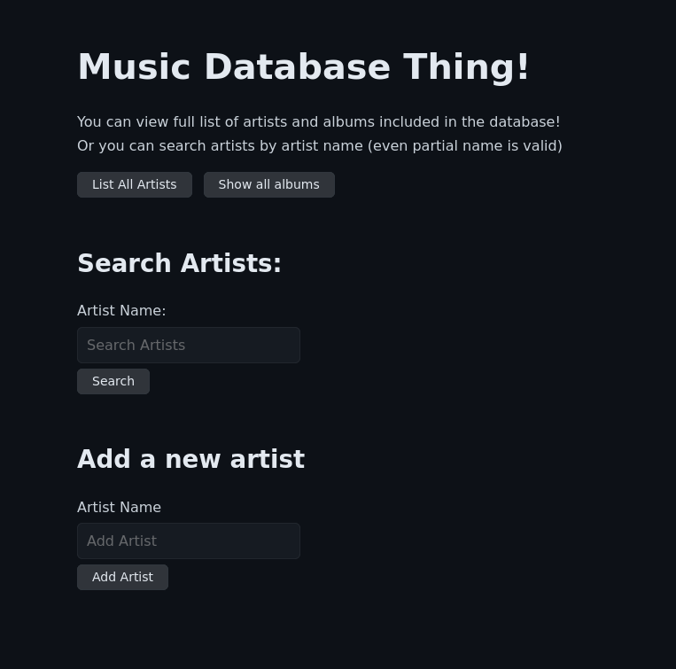

# Music Database Thing
*My music database web application made with Java for the Programming 2 course.* 

[**Original embedded-tomcat-template, with descriptions, which is used as a base for this!**](https://github.com/ohjelmointi2/embedded-tomcat-template)



The application is designed and tested to work especially with [Chinook music database](https://github.com/lerocha/chinook-database) (SQLite version).

Made using:
- Linux, Debian 11
- [IntelliJ IDEA 2023.1 (Ultimate Edition)](https://www.jetbrains.com/idea/download/#section=linux)
- Java version 17.0.6.

To meet the required submission format (.zip), the project was also tested to import to, and run on:
-  [Eclipse IDE for Enterprise Java and Web Developers 2023-03](https://www.eclipse.org/downloads/)
- Java version 17.0.6.

To function, the application requires an environment variable set in the IDE
- Name: JDBC_DATABASE_URL
- Path `jdbc:sqlite:/<absolute_path_to>/Chinook_Sqlite.sqlite`

The application features the following functionalities:

-   Listing all artists in the database, displaying the number of albums for each artist.
-   Listing all albums in the database
-   Searching for artists by partial name
-   Listing all albums by a specific artist
	- Artist names serves the link to.
-   Listing all songs on a specific album
	- Album names serves the link to.
		- Bonus feature: Link to earch song lyrics from an external service (DuckDuckGo)
-   Adding and removing artists
-   Adding and removing albums

The UI and the code:

- Clear dark UI with simple "Index" and "Back" navigation links. 
	- Classless CSS: https://github.com/Kimeiga/bahunya.   
- Connecting to database is made in its own separate class
- Closing the database connection is made with using `try-with-resources` statements.
	- Sources used:
		- https://ohjelmointi2.github.io/04_tietokantaohjelmointi/try-with-resources
		- https://docs.oracle.com/javase/tutorial/essential/exceptions/tryResourceClose.html

Other sources:
[Haaga-Helia: Ohjelmointi 2 course material](https://ohjelmointi2.github.io/)   
[Oracle: Java Tutorials](https://docs.oracle.com/javase/tutorial/)   
[Java EE Tutorials](https://www.codejava.net/java-ee/)   
[DuckDuckGo](https://duckduckgo.com/?q=How+to+get+things+done+with+java)   

The project was intentionally designed to have as much functionality as possible in one place, meaning that conditional statements are used alot in JSP files and Servlets to determine the page's display and function. This is because the project is small, and the goal was to make it as compact as possible.    
In a larger project, the code would have been distributed more among separate files.

My new and edited files vs the original template:
```bash
├── pom.xml
├── README.md
├── screenshot.png
├── src
│   ├── main
│   │   ├── java
│   │   │   ├── database
│   │   │   │   ├── AlbumDao.java
│   │   │   │   ├── ArtistDao.java
│   │   │   │   ├── Database.java
│   │   │   │   └── TrackDao.java
│   │   │   ├── launch
│   │   │   │   └── Main.java #Not edited
│   │   │   ├── model
│   │   │   │   ├── Album.java
│   │   │   │   ├── Artist.java
│   │   │   │   └── Track.java
│   │   │   └── servlet
│   │   │       ├── AlbumsServlet.java
│   │   │       ├── ArtistsServlet.java
│   │   │       ├── IndexServlet.java
│   │   │       ├── SearchServlet.java
│   │   │       └── TrackListServlet.java
│   │   └── webapp 
│   │       └── WEB-INF
│   │           ├── albumList.jsp
│   │           ├── artistList.jsp
│   │           ├── Index.jsp
│   │           └── TrackList.jsp
```
